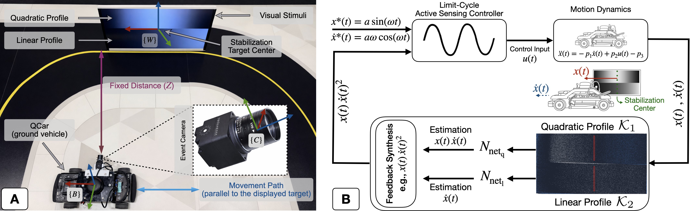

   
  

     

  
    ⚠️ Code and datasets will be made publicly available upon paper acceptance ⚠️
  

# BioInspiredEBVS

**Authors:** [Maral Mordad](https://www.linkedin.com/in/maral-mordad),
[Kian Behzad](https://www.linkedin.com/in/kianbehzad/),
[Debojyoti Biswas](https://www.linkedin.com/in/debojyoti-biswas-ph-d-16622157),
[Noah J. Cowan*](https://engineering.jhu.edu/faculty/noah-cowan/),
[Milad Siami*](https://coe.northeastern.edu/people/siami-milad/)

* N. J. Cowan and M. Siami share senior authorship.

## Overview

This project presents a bio-inspired event-based visual servoing (EBVS) framework for ground robots using event-based cameras. The goal is to achieve stable and responsive control directly from visual input, without relying on traditional pipelines such as feature detection, tracking, or state estimation, which are computationally expensive. Instead, the method draws inspiration from active sensing mechanisms observed in biological systems, where motion and perception are tightly coupled.

The proposed approach leverages a Dynamic Vision Sensor (DVS) in combination with carefully designed visual stimuli displayed in the environment. Specifically, structured intensity patterns (linear and quadratic profiles) are used so that the stream of asynchronous events generated by the camera encodes meaningful motion information. By defining spatial kernels over these patterns and accumulating net event counts, the system directly estimates key quantities such as the image-plane velocity and a nonlinear term proportional to position–velocity interaction.

These measurements are then used to synthesize a feedback control law directly in the sensing domain. Unlike classical visual servoing methods, this framework bypasses explicit reconstruction of position or pose. However, due to reduced observability near equilibrium, the system adopts an active sensing strategy: instead of stabilizing to a fixed point, it regulates the robot to a stable limit cycle, ensuring persistent excitation and reliable perception.

### Contributions

- **Event-based control without state estimation:** A direct mapping from event streams to control inputs, eliminating the need for feature extraction or filtering pipelines.
- **Structured stimulus design:** Use of linear and quadratic visual patterns to encode motion information in the event domain.
- **Kernel-based event estimation:** A principled method to extract velocity and nonlinear motion terms from net event counts.
- **Active sensing control strategy:** A limit-cycle stabilization approach that maintains observability and robustness.
- **Real-world validation:** Experimental results on a ground robot platform (QCar) with a Prophesee event camera, demonstrating closed-loop performance and adaptability to changing targets.

 

    

 

## Demo

Demo is under construction, for now let's have a minimal video:
<!-- TODO -->